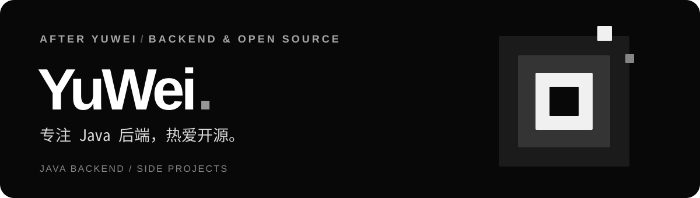
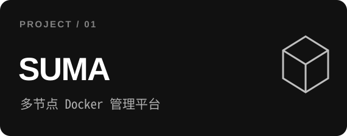
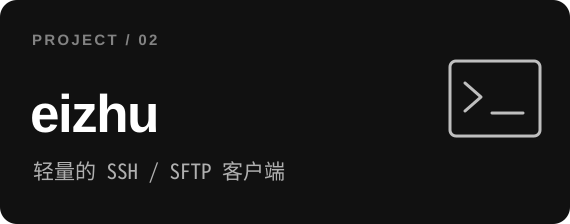
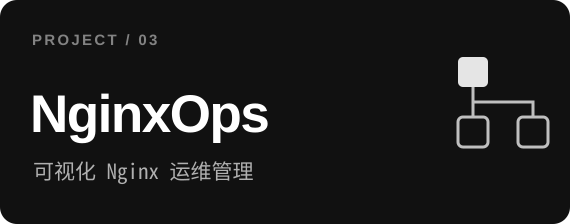

  

### 你好，我是 YuWei

一名热爱开源的全栈开发者，关注 **开发者工具、云原生与基础设施**。  
喜欢把复杂的技术问题，做成简单、实用、可靠的产品。

### 精选作品

  
  

  
  

### 技术与方向

**应用开发** · `Go` `TypeScript` `Rust` `React` `Java`  
**基础设施** · `Docker` `Kubernetes` `Linux` `Nginx` `PostgreSQL`

### 正在关注

构建更易用的运维与开发工具，探索 AI 与云原生技术在真实场景中的应用。

[查看全部仓库 ↗](https://github.com/AfterYuWei?tab=repositories) · [GitHub ↗](https://github.com/AfterYuWei)
